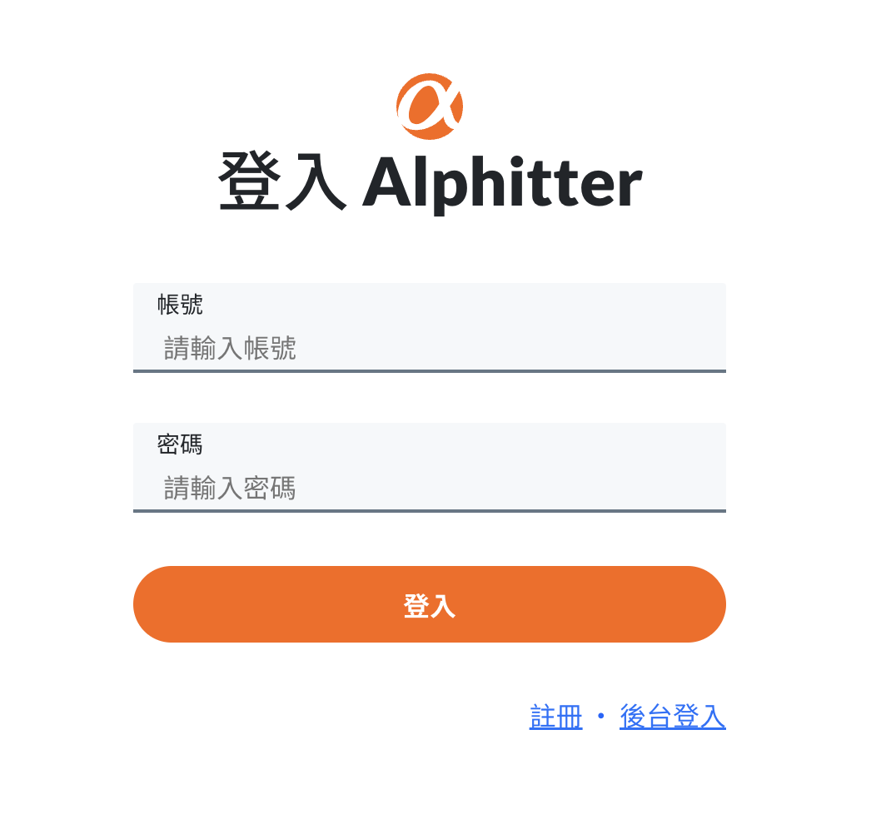

# ALPHA Simple Twitter

ALPHA CAMP Season 3 Assignment

---

## Project Preview

---

## About The Project

This project is the final project of Alpha Camp online web development bootcamp. It requires an overall knowledge in web development acquired from either front-end or back-end course module. 

Simple Twitter is a social networking website inspired by Twitter. Users can register their own account browse the tweets from other users after logging in. You can publish your own tweet, reply others’ tweets, press like/unlike and follow/unfollow other users. The account owner can also edit your personal information such as your name, self-introduction, and change avatar or cover photo. Besides the regular user accessibility, with a designated account and password, you can log in to the admin page where you have a overall view of all the tweets published on the platform and all the users created. 

The site uses API to communicate with a database managed by back-end partners, where all the data needed on the site are stored.

### Built with

- React.js
- scss/sass
- bootstrap
- clsx
- Sweetalert
- jsonwebtoken

---
## Getting Started

### Prerequisites

Ensure you have node.js and npm installed

### Installation

1. Clone the project using the command below: 

   `git clone https://github.com/RubyTzu/simple-twitter.git`

2. Direct to the location of this file and enter the command:

   `npm install`

3. After installing, use `npm start` to start the project. 
   - In case the web app doesn’t come out automatically, please navigate to [http://localhost:3000](http://localhost:3000) manually.
   - To terminate the web app, use `ctrl + c` to terminate

---

## Contact

(Ruby Chen)[rrubyitzuchen@gmail.com]  
(Kaijun Huang)[kaijun_huang@outlook.com]

---

## Acknowledgment

Front-end: Ruby Chen, Kaijun Huang

Back-end: Ching Lin, Ben Wang

---

